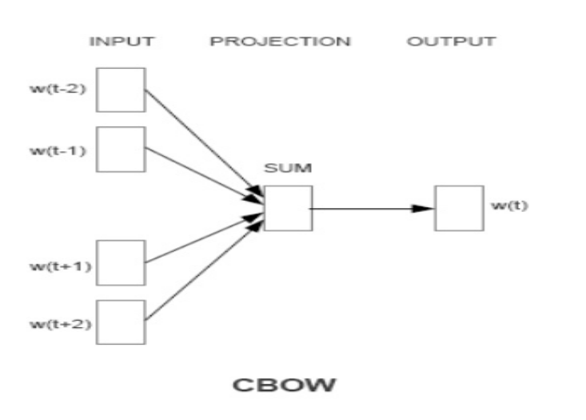
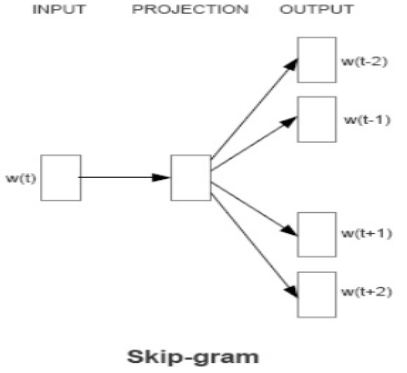

# Word2Vec

Generation of proper word embeddings is the base of every downstream NLP tasks. Bag of Words and TF-IDF approaches for converting textual data to vectoral representation fails on catching the contextual representation of the tokens in any textual data. By using pretrained word2vec, we can include such vectoral representations in our generic NLP tasks. However, by training a custom word2Vec model, we can apply word embeding generated from such model to our domain based specific tasks.

> Goal --> Learning high quality word vectors from huge datas sets with billion of words in its vocabulary

---

# Directory Structure

└──word2vec

    └── cvdata      📄 contains data of resumes and job descriptions which is used for training the custom word2vec model from such data

    └── models      contains the trained and pretrained word2vec models

    └── word2vec

        └── parse_data.py   module for preparing training data from the cvdata directory files

        └── train_w2v.py    module for training custom word2vec

    └── main.py         module for development of word2vec training dashboard using streamlit

    └── try_word2vec.py     module for generating similarity between two tokens, generating word_embeddings of testing tokens

    └── config.py       for mantaining paths of models and data

    └── Dockerfile      dockerfile  for deployment of dashboard in server

    └── docker-compose.ynml     supporting dockerfile for allocation of ports

    └── nltk_download.py        module for downloading necessary corpus from nltk module

    └── requirements.txt        list of modules used for running the application

    try_word2vec.html           auto generated documentation file of try_word2vec module

# Appraoches used for training custom Word2Vec models

## Continous Bag of Words (CBoW)

### Description

This approach is highly similar to a feed forward neural network language model trained with the purpose of getting word embedding from it's hidden layer. However, in CBoW model

- the non linear hidden layer is removed.
- projection layer is shared for all words
- all words are projected into same position
- use words from past and future or window centered on current word

### Architecture

## Continous Skip Gram model

Similar to CBoW model but instead of predicting the current word based on the context tries to predict context within a certain window from given input word.

### Description

Similar to CBoW model but instead of predicting the current word based on the context tries to predict context within a certain window from given input word.

### Architecture

# Parameters used for training word2vec

- size ----> Dimensionality of word vectors
- Window ----> Maximum distance between the current and predicted word within a sentence
- Workers ----> How many threads bto be used for training the model
- min_count ---> minimum count of occurance of words
- sg ----> approach to be used for training

# Findings from training custom Word2Vec

- Larger window size leads to better quality of resulting word vectors and higher training time
- More distant words are usually less related to the current word than close to it
- Give less weight to the distant words by sampling less from those words in the training examples
- Training high dimensional word vectors on a large amount of data captures subtle semantic relationship between words
